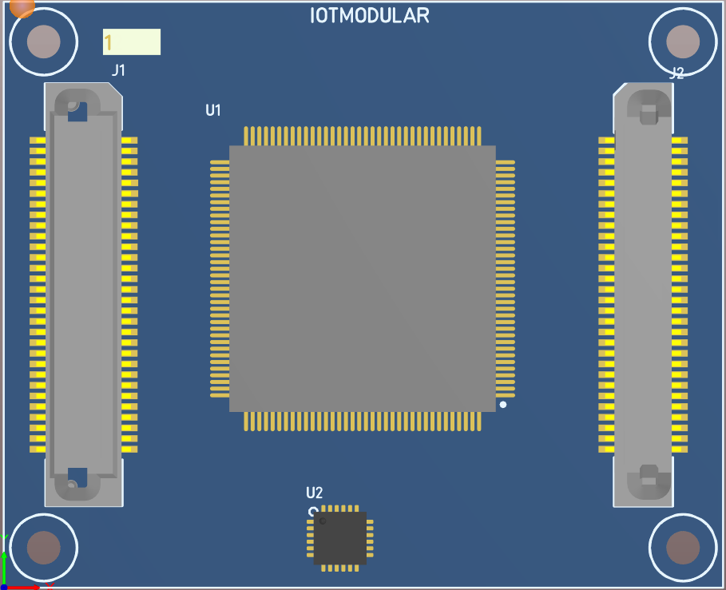

#[IOTM222](https://github.com/nikoschalikias/IOTM222)  

An IOTmodular MACHXO2 FPGA board 

## PCB initial placement
Using 	TQFP-144 the board is easy routable, while BGA132 makes routing very hard.

 

## Breakout board
LCMXO2-7000HE-B-EVN

 

 

 

## Old definition
N-FPGA  
MACHXO2 4000LE + CP2112 USB  
SMALL FOOTPRINT ICS, NON VOLATILE FPGA  
N-MOTE FORMAT BOARD  

## Links
*  [LCMXO2-4000HC-5TG144I](https://www.mouser.ie/ProductDetail/Lattice/LCMXO2-4000HC-5TG144I?qs=T%2FOtf55vL7fdExHgYLOKvw%3D%3D)
*  [X-ON LCMXO2-7000HE-B-EVN Programmable Logic IC](https://www.amazon.co.uk/X-LCMXO2-7000HE-B-EVN-Programmable-Logic-Development/dp/B0131VG5YE/ref=sr_1_1?dchild=1&keywords=lcmxo2&qid=1617793108&sr=8-1)
*  [Digikey: LCMXO2-7000HE-B-EVN](https://www.digikey.ie/product-detail/en/lattice-semiconductor-corporation/LCMXO2-7000HE-B-EVN/220-2625-ND/3906092)
*  [Mouser: LCMXO2-7000HE-B-EVN](https://www.mouser.ie/ProductDetail/Lattice/LCMXO2-7000HE-B-EVN?qs=DBbQ3l7BldNJuSVNFnSpPw==)
